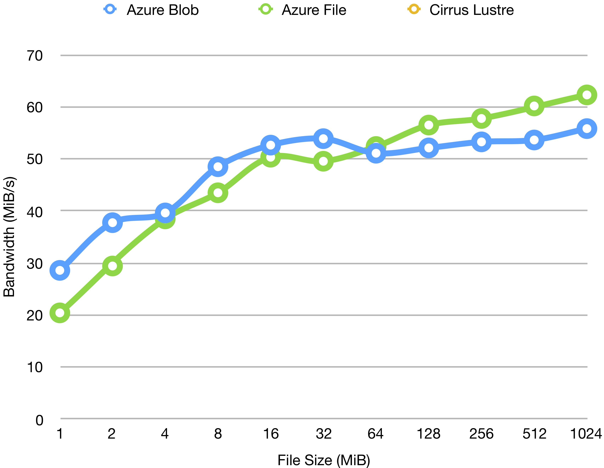

# Azure HPC IO
## Overview
Benchmarking tool for I/O performance on Azure Storage for HPC purpose. 

## Usage

## Azure Storage Specifications
### Product Features
| Item | Azure Block Blob | Azure File |
| :------------- |:-------------| :-----|
| Capacity | 500 TiB / container | 5TiB / file share |
| File Size | 4.75 TiB per block blob | 1 TiB per file |
| Throughput | 60 MiB/s or 500 requests/s | 60 MiB/s or 1000 IOPS  |

### Product Prices
Here we specify the cost for **General Purpose v1** accounts on **UK South**. **LRS**(Locally Redundant Storage) is used in our testcase. Further details of other options can be found on [Azure](https://azure.microsoft.com/en-us/pricing/details/storage/blobs/)

| Storage Capacity | Azure Block Blob | Azure File |
| :------ | :-------| :-------|
| 0 ~ 1 TB / month | £0.0224 per GB | £0.056 per GB |
| 1 ~ 50 TB / month |  £0.0220 per GB | £0.056 per GB |
| 50 ~ 500 TB / month |  £0.0217 per GB | £0.056 per GB |
| 500 ~ 1000 TB / month |  £0.0213 per GB | £0.056 per GB |
| 1000 ~ 5000 TB / month |  £0.0209 per GB | £0.056 per GB |

| Operations | Azure Block Blob | Azure File |
| :------ | :-------| :-------|
| Any Operations per 10,000 | £0.00027 | £0.0112 |

## Environments
| Dependency | Cirrus | Azure VMs |
| :------ | :-------| :-------|
| Python | 3.6.4 | 3.6.3 |
| MPI | HPE MPT 2.16 | Open MPI 1.10.7 |
| mpi4py | 3.0.0 | 3.0.0 |
| numpy | 1.14.0 | 1.14.5 |
| azure-common | 1.1.12 | 1.1.13 |
| azure-storage | 0.36.0 | 0.36.0 |

## Input
### File Size
Experiments run on **5 Nodes, 4 processes** each. 

#### Latency
| File Size(MiB) | Azure Block Blob (s) | Azure File (s) | Cirrus (s) |
| :------ | :-------| :-------| :-------|
| 1 | 0.035 | 0.049 |  |
| 2 | 0.053 | 0.068 |  |
| 4 | 0.101 | 0.104 |  |
| 8 | 0.165 | 0.184 |  |
| 16 | 0.304 | 0.318 |  |
| 32 | 0.594 | 0.646 |  |
| 64 | 1.253 | 1.222 |  |
| 128 | 2.457 | 2.266 |  |
| 256 | 4.807 | 4.433 |  |
| 512 | 9.549 | 9.511 |  |
| 1024 | 18.350 | 16.442 | |

#### Bandwidth
| File Size(MiB) | Azure Block Blob (MiB/s) | Azure File (MiB/s) | Cirrus (MiB/s) |
| :------ | :-------| :-------| :-------|
| 1 | 28.571 | 20.408 |  |  
| 2 | 37.736 | 29.412 |  |
| 4 | 39.604 | 38.462 |  |
| 8 | 48.485 | 43.478 |  |
| 16 | 52.632 | 50.314 |  |
| 32 | 53.872 | 49.536 |  |
| 64 | 51.077 | 52.373 |  |
| 128 | 52.096 | 56.487 |  |
| 256 | 53.256 | 57.749 |  |
| 512 | 53.618 | 60.157 |  |
| 1024 | 55.804 | 62.280 |  |

### Nodes
Experiments run on **20** processes with file size fixed at 64 MiB.

#### Latency
| Procs/Node | Nodes | Azure Block Blob (s) | Azure File (s) | Cirrus (s) |
| :------ | :-------| :-------| :-------| :-------|
| 1 | 20 | 1.274 | 1.208 |  |
| 2 | 10 | 1.218 | 1.194 |  |
| 4 | 5 | 1.271 | 1.188 |  |
| 6 | 4 |  |  |  |
| 8 | 3 |  |  |  |

#### Bandwidth
| Procs/Node | Nodes | Azure Block Blob (MiB/s) | Azure File (MiB/s) | Cirrus (MiB/s) |
| :------ | :-------| :-------| :-------| :-------|
| 1 | 20 | 50.235 | 52.980 |  |
| 2 | 10 | 52.545 | 53.601 |  |
| 4 | 5 | 50.354 | 53.872 |  |
| 6 | 4 |  |  |  |
| 8 | 3 |  |  |  |

### Number of processes
TBD.

### Potential Improvments
Master get & bcast; Multiple containers; Block sizes etc.

## Output