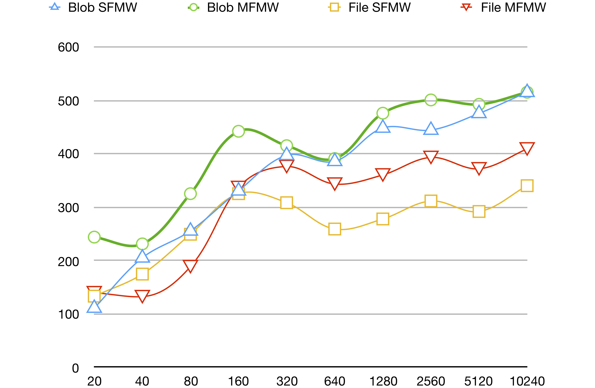

# Azure HPC IO
## Overview
Benchmarking tool for I/O performance on Azure Storage for HPC purpose. 

## Usage

## Azure Storage Specifications
### Product Features
| Item | Azure Block Blob | Azure File |
| :------------- |:-------------| :-----|
| Capacity | 500 TiB / container | 5TiB / file share |
| File Size | 4.75 TiB per block blob | 1 TiB per file |
| Throughput | 60 MiB/s or 500 requests/s | 60 MiB/s or 1000 IOPS  |

### Product Prices
Here we specify the cost for **General Purpose v1** accounts on **UK South**. **LRS**(Locally Redundant Storage) is used in our testcase. Further details of other options can be found on [Azure](https://azure.microsoft.com/en-us/pricing/details/storage/blobs/)

| Storage Capacity | Azure Block Blob | Azure File |
| :------ | :-------| :-------|
| 0 ~ 1 TB / month | £0.0224 per GB | £0.056 per GB |
| 1 ~ 50 TB / month |  £0.0220 per GB | £0.056 per GB |
| 50 ~ 500 TB / month |  £0.0217 per GB | £0.056 per GB |
| 500 ~ 1000 TB / month |  £0.0213 per GB | £0.056 per GB |
| 1000 ~ 5000 TB / month |  £0.0209 per GB | £0.056 per GB |

| Operations | Azure Block Blob | Azure File |
| :------ | :-------| :-------|
| Any Operations per 10,000 | £0.00027 | £0.0112 |

## Environments
| Dependency | Cirrus | Azure VMs |
| :------ | :-------| :-------|
| Python | 3.6.4 | 3.6.3 |
| MPI | HPE MPT 2.16 | Open MPI 1.10.7 |
| mpi4py | 3.0.0 | 3.0.0 |
| numpy | 1.14.0 | 1.14.5 |
| azure-common | 1.1.12 | 1.1.13 |
| azure-storage | 0.36.0 | 0.36.0 |

## Input
### Overview
This section reveals the test result on inputs benchmarking. 'Single File, Multiple Readers' pattern is used in this test. Every processes downloads the entire blob/file from cloud native storage in bytes. The length of data is restricted to the available memory for the process. Results for running on a lustre file system within Cirrus are also attached.

### File Size
Experiments run on **5 Nodes, 4 processes** each. 

| File Size(MiB) | Azure Block Blob (MiB/s) | Azure File (MiB/s) | Cirrus (MiB/s) |
| :------ | :-------| :-------| :-------|
| 1 | 28.571 | 20.408 | 333.333 |  
| 2 | 37.736 | 29.412 | 1000 |
| 4 | 39.604 | 38.462 | 400 |
| 8 | 48.485 | 43.478 | 800 |
| 16 | 52.632 | 50.314 | 800 |
| 32 | 53.872 | 49.536 | 1103.448 |
| 64 | 51.077 | 52.373 | 901.408 |
| 128 | 52.096 | 56.487 | 914.286 |
| 256 | 53.256 | 57.749 | 948.148 |
| 512 | 53.618 | 60.157 | 971.537 |
| 1024 | 55.804 | 62.280 | 837.285 |

### Nodes
Experiments run on **20** processes with file size fixed at 64 MiB.

| Procs/Node | Nodes | Azure Block Blob (MiB/s) | Azure File (MiB/s) | Cirrus (MiB/s) |
| :------ | :-------| :-------| :-------| :-------|
| 1 | 20 | 50.235 | 52.980 | 771.084 |
| 2 | 10 | 52.545 | 53.601 | 1163.636 |
| 4 | 5 | 50.354 | 53.872 | 1103.448 |
| 6 | 4 |  |  | 1032.258 |
| 8 | 3 |  |  | 941.176 |

### Number of processes
TBD.

### Potential Improvments
AsyncI/O & Get range; Multiple containers; Block sizes etc.

### Analysis

## Output
### Overview
This section presents the result on outputs benchmarking. 'Single file, Multiple Writers' together with 'Multiple files, multiple writers' pattern are used in this experiment and each process will update an individual single section of the whole file. Sections is divided evenly across processes. Results for running on a lustre file system within Cirrus are also attached.

### File Size
Experiments run on **5 Nodes, 4 processes** each.

#### Single File, Multiple Writers
Demonstrations on how to do SFMW pattern on Azure can be found in [Blob](doc/img/blobsfmw.jpg) and [File](doc/img/filesfmw.jpg)

| Size(MiB) per Proc | Total Size(MiB) | Blob(MiB/s) | File(MiB/s) | Cirrus(MiB/s) |
| :------ | :-------| :-------| :-------| :-------|
| 1    |    20 | 111.111 | 133.333 |  |
| 2    |    40 | 205.128 | 174.672 |  |
| 4    |    80 | 255.591 | 249.221 |  |
| 8    |   160 | 330.579 | 325.203 |  |
| 16   |   320 | 397.022 | 308.285 |  |
| 32   |   640 | 385.775 | 259.004 |  |
| 64   |  1280 | 448.179 | 277.838 |  |
| 128  |  2560 | 444.290 | 311.473 |  |
| 256  |  5120 | 475.483 | 291.854 |  |
| 512  | 10240 | 515.039 | 340.143 |  |

#### Multiple Files, Multiple Writers
| Size(MiB) per Proc | Total Size(MiB) | Blob(MiB/s) | File(MiB/s) | Cirrus(MiB/s) |
| :------ | :-------| :-------| :-------| :-------|
| 1    |     20 | 243.902 | 139.860 |  5000.000 |
| 2    |     40 | 231.214 | 132.450 | 10000.000 |
| 4    |     80 | 325.203 | 188.679 | 11428.571 |
| 8    |    160 | 441.989 | 336.842 |  5714.286 |
| 16   |    320 | 415.045 | 376.028 |  2388.060 |
| 32   |    640 | 390.959 | 343.164 |  2549.801 |
| 64   |   1280 | 475.836 | 360.259 |  3350.785 |
| 128  |   2560 | 500.685 | 393.060 |  2952.710 |
| 256  |   5120 | 492.402 | 371.742 |  3017.089 |
| 512  |  10240 | 515.039 | 408.962 |  2833.426 |

#### Trends on Azure

### Nodes
Experiments run on **20** processes with file size fixed at 64 MiB.

#### Bandwidth

## Number of processes
TBD.

### Potential Improvments
Compression & Metadata for management

### Analysis