# Input Benchmarking
## Background
For a traditional HPC applications hosted on dedicated supercomputers such as [Cirrus](https://www.epcc.ed.ac.uk/facilities/demand-computing/cirrus) or [Archer](http://www.archer.ac.uk/), normally we have the I/O hierachy as is shown is the figure. However, if we want to migrate our HPC code to host in a cloud-native environments and interact with cloud-native storage, it is not easy to utilize the framework enhancements on I/O (e.g MPI's collective I/O). So, similar to directly use POSIX I/O for inputs & outputs, we use cloud APIs to access the cloud storage.

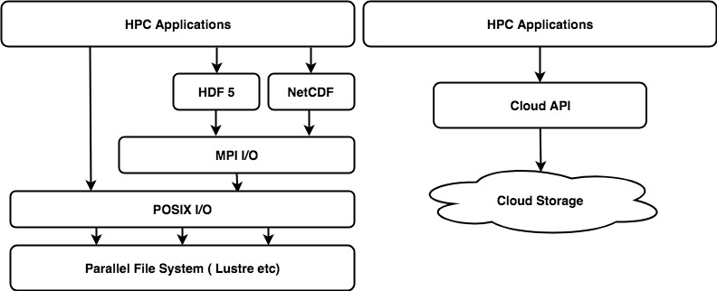

## Strategy
Since we target at cloud-native storage such as web-based object storage or file storage, by input we mean that download the data via HTTP and load them into our VM's memory for further processing. For the inputs, we assume that the source data can be evenly divided and each processes accounts for processing one distinct sections at a time. Based on these conditions, we introduce the following input patterns.

### Single Reader & Broadcast
Assume that we are using MPI framework for process managements. Process at rank 0 will download all the data into its memory and then it will distribute sections of data to each processes accordingly.

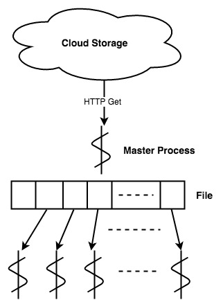

Restricted by the available memory for cloud VMs, the master process can only download a specified amount of data. Besides, the interconnect within HPC clusters deployed in public clouds is not as fast as in a supercomputer. So, generally, this strategy is not well suited for a cloud native HPC solution.

### Singel File, Multiple Readers
Every process reads a range of or the entire data from a shared file.

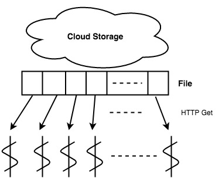

Cloud provide range get APIs which could help in applying this pattern.

### Multiple Files, Multiple Readers
Source data has been originally present or pre-processing into serval different files. Each process reads their corresponding files. 

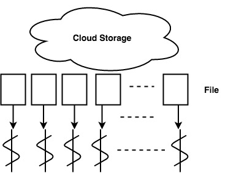

This strategy requires source data to be pre-processed and well matched with the amount of processes we are going to use. However, since there are no corruptions between files, this strategy is well parallelized.

## Conditions
* The application are run with one process per core
* The amount of data each process downloads is restricted by the available memory
* The limitation of a single Azure Blob is 4.75 TiB and Azure File is 1 TiB
* Block Blob is used for Blob benchmarking and default block size are used

## Benchmark
This section reveals the performance of 'Single File, Multiple Readers' and 'Multiple Files, Multiple Readers' pattern using Azure's cloud-native storage. Reading from Azure Blob, Azure File and corresponding operations using POSIX I/O on Cirrus Lustre file system are performed and results are listed.

Experiments run on **5 nodes, 4 processes** each. Azure Standard **A4_v2** VM configurations are used. Results got from 100 iterations of benchmarkings.

For 'Multiple Files, Multiple Readers' pattern, files are evenly divided into corresponding sub-files. E.g. 100 GiB file, 20 processes, we divide it into 20 small files with 5 GiB each. Each processes reads their own file.

For all I/O operations, there are limits on data sizes for each operation. If the size of data exceeds the limits, the operation will be sepearated into serval sub-ops that make up the entire operation. For instance, if we want to update a 4 GiB file with the limit of 1GiB, the operation will be divided into 4 sub-ops that upload 1 GiB each time.

### Start Up
As is restricted by the VM's memory, for each downloads we can only get the inputs less than 1.5 GiB on **A4_v2**. For start up, we test the case that all the processes downloads the entire file with the size that could be directly loaded into memory. Demonstrations for this pattern can be found below:

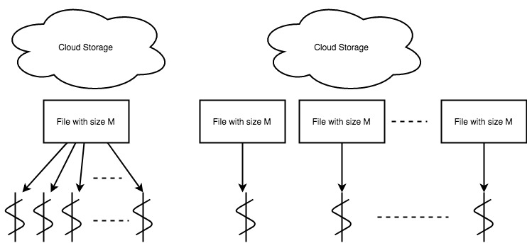

#### Single File, Multiple Readers
| File Size(MiB) | Blob Latency (s) | Blob Bandwidth (MiB/s) | File Latency (s) | File Bandwidth (MiB/s) | Cirrus Latency (s) | Cirrus Bandwidth (MiB/s) |
| :------ | :-------| :-------| :-------| :-------| :-------| :-------|
|    1 |   0.028 |  714.286 |  0.031 |  645.161 | 0.00054 | 41410.667 |  
|    2 |   0.051 |  784.314 |  0.056 |  714.286 | 0.00078 | 58629.310 |
|    4 |   0.100 |  800.000 |  0.106 |  754.717 | 0.00219 | 46300.980 |
|    8 |   0.184 |  869.565 |  0.185 |  864.865 | 0.00614 | 27549.086 |
|   16 |   0.344 |  930.233 |  0.337 |  949.555 | 0.01371 | 24720.609 |
|   32 |   0.666 |  960.961 |  0.665 |  962.406 | 0.02705 | 24687.693 |
|   64 |   1.455 |  879.725 |  1.296 |  987.654 | 0.05340 | 24705.756 |
|  128 |   2.664 |  960.961 |  2.519 | 1016.276 | 0.10619 | 24792.336 |
|  256 |   5.147 |  994.754 |  4.911 | 1042.558 | 0.21040 | 24888.401 |
|  512 |  10.312 |  993.018 |  9.874 | 1037.067 | 0.41864 | 24914.730 |
| 1024 |  20.238 | 1101.958 | 18.774 | 1090.870 | 0.83658 | 24900.500 |

##### Blob Summary
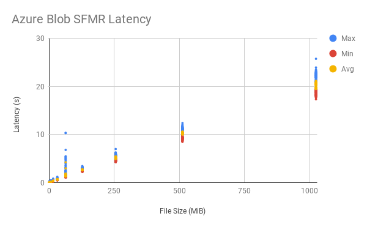
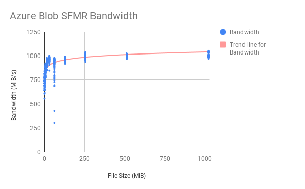

##### File Summary
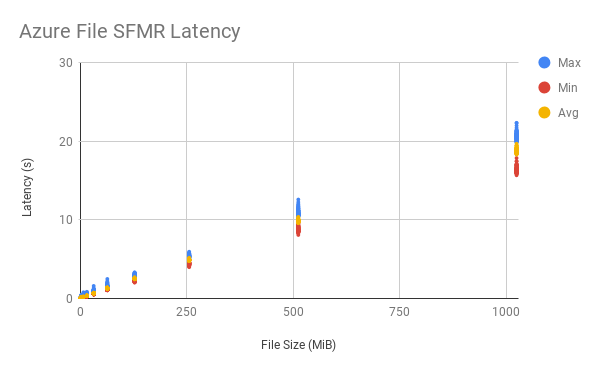
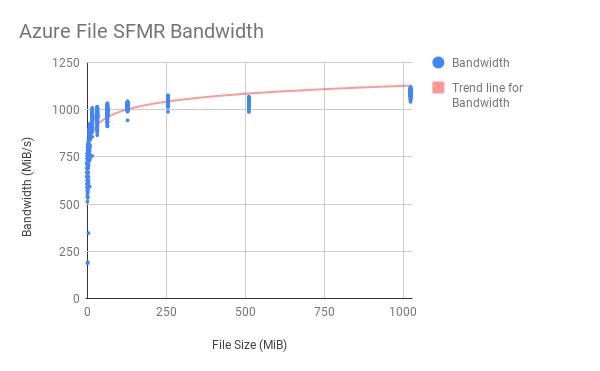

#### Multiple Files, Multiple Readers
| File Size(MiB) | Blob Latency (s) | Blob Bandwidth (MiB/s) | File Latency (s) | File Bandwidth (MiB/s) | Cirrus Latency (s) | Cirrus Bandwidth (MiB/s) |
| :------ | :-------| :-------| :-------| :-------| :-------| :-------|
|    1 |  0.027 |  758.450 |  0.031 |  669.768 | 0.00081 | 26635.568 |  
|    2 |  0.045 |  803.504 |  0.052 |  773.042 | 0.00116 | 38504.435 |
|    4 |  0.098 |  823.551 |  0.099 |  815.125 | 0.00244 | 35799.205 |
|    8 |  0.178 |  899.512 |  0.179 |  893.923 | 0.00652 | 26159.538 |
|   16 |  0.323 |  992.151 |  0.316 | 1014.107 | 0.01420 | 23998.060 |
|   32 |  0.635 | 1009.065 |  0.628 | 1020.623 | 0.02763 | 24536.958 |
|   64 |  1.275 | 1004.690 |  1.264 | 1013.538 | 0.05401 | 25027.442 |
|  128 |  2.576 |  994.269 |  2.465 | 1038.989 | 0.10674 | 25294.909 |
|  256 |  5.058 | 1012.574 |  4.787 | 1069.803 | 0.21201 | 25427.419 |
|  512 |  9.992 | 1025.015 |  9.407 | 1088.700 | 0.42471 | 25534.398 |
| 1024 | 19.588 | 1045.939 | 18.168 | 1127.883 | 0.84763 | 25602.445 |	

##### Blob Summary
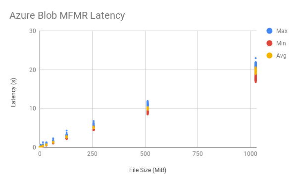
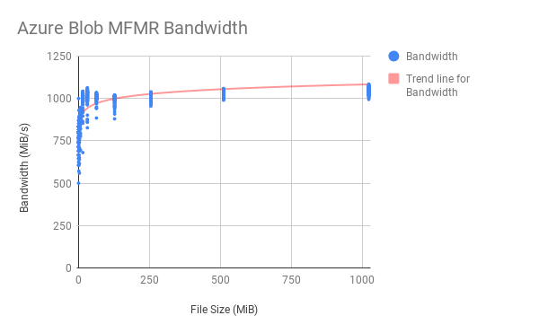

##### File Summary
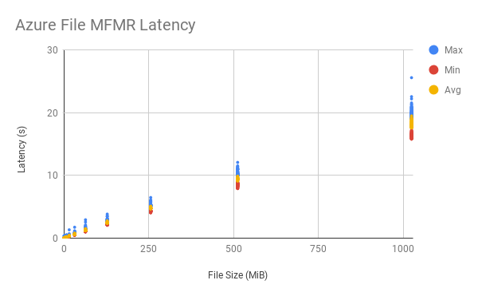
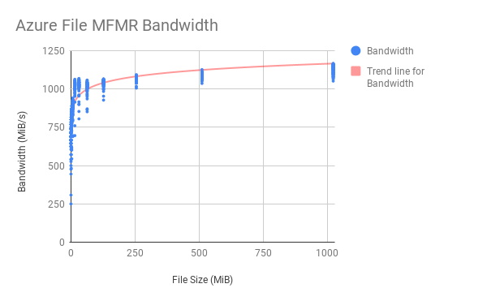

### Comparison
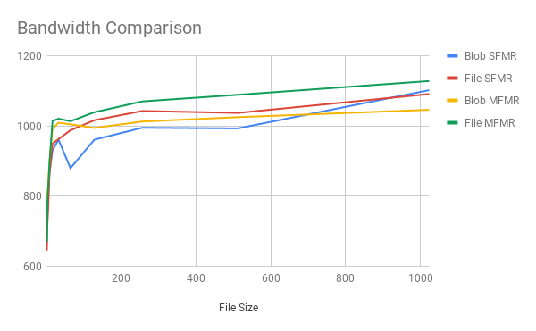

### Extended to Larger File Sizes
This section reveals the performance of getting a large single file from the cloud. As is limited by the available memory size of host VMs, for a large inputs it is impossible to download the entire file at once. So the source file is evenly divided into serval sub-sections and each processes is responsible for one of them. (e.g for a 500 GiB file with 20 processes processing on it, each process will work on its 25 GiB sub-section) Demonstrations for this pattern is represented below:

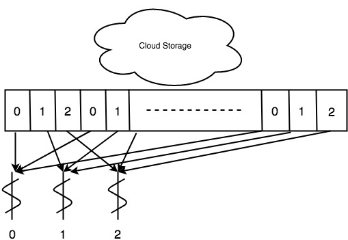

| File Size(GiB) | Blob Latency (s) | Blob Bandwidth (MiB/s) | File Latency (s) | File Bandwidth (MiB/s) |
| :------ | :-------| :-------| :-------| :-------|
| 500             |  519.779 |  985.102 | 447.419 | 1144.734 |
| 1000            |  985.565 | 1039.444 | 893.644 | 1146.168 |
| 2560(~2.5 TiB)  | 2488.895 | 1054.017 |     N/A |      N/A |
| 4860(~4.75 TiB) | 4778.008 | 1003.469 |     N/A |      N/A |