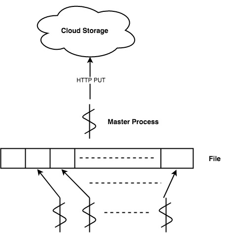
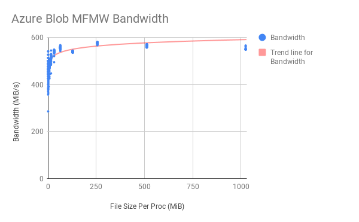
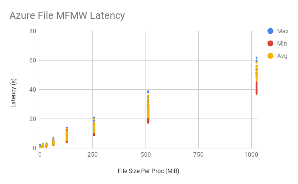
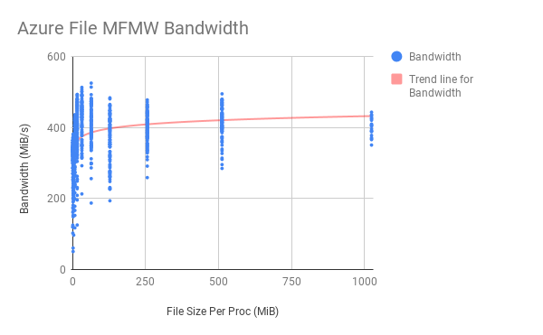

# Output Benchmarking
## Background
For a traditional HPC applications hosted on dedicated supercomputers such as [Cirrus](https://www.epcc.ed.ac.uk/facilities/demand-computing/cirrus) or [Archer](http://www.archer.ac.uk/), normally we have the I/O hierachy as is shown is the figure. However, if we want to migrate our HPC code to host in a cloud-native environments and interact with cloud-native storage, it is not easy to utilize the framework enhancements on I/O (e.g MPI's collective I/O). So, similar to directly use POSIX I/O for inputs & outputs, we use cloud APIs to access the cloud storage.

## Strategy
Since we target at cloud-native storage such as web-based object storage or file storage, by output we mean that upload data from local VM's memory to cloud storage via HTTP. For the outputs, we assume that each processes uploads same amount of data to cloud-native storage. Based on these conditions, we introduce the foloowing output patterns.

### Single File, Singe Writer
This pattern is also called Master IO. Assume that we are using MPI framework for process managements. Process at rank 0 will collect all the data from each processes into its memory and then it will upload the entire data to cloud-native storage.

Restricted by the available memory for cloud VMs, the master process can only keep a specified amout of data in its memroy. Besided, the interconnect within HPC clusters deployed in public clouds is not as fast as in a supercomputer. So, generally, this strategy is not well suited for a cloud native HPC solution.

### Single File, Multiple Writers
Every process writes a range of or their entire data to a shared file. Every processes accounts for a specified range of the file.

For a traditional I/O pattern, it is not recommended for doing multiple writes on a single file. However, with the range write features provided by cloud-native storage, we could easily apply this pattern in the cloud, but in order to achieve this goal in the cloud, some extra post-processing or pre-processing is required.

### Multiple Files, Multiple Writers
This is the simplest pattern to avoid the racing as each processes writing its data to seperate files. 

This strategy is easy to apply. But, some of the post-processing might be required for further processing on those results.

## Conditions
* The application are run with one process per core
* The amount of data each process uploads is restricted by the available memory
* The limitation of a single Azure Blob is 4.75 TiB and Azure File is 1 TiB
* Block Blob is used for Blob benchmarking and default block size are used
* Each Block for Block Blob is less than 100 MiB
* Each section of range update on Azure File is less than 4 MiB

## Benchmark
This section reveals the performance of 'Single File, Multiple Writers' and 'Multiple Files, Multiple Writers' pattern using Azure's cloud-native storage. Writing to Azure Blob, Azure File and corresponding operations using POSIX I/O on Cirrus Lustre file system are performed and results are listed.

Experiments run on **5 nodes, 4 processes** each. Azure Standard **A4_v2** VM configurations are used. Results got from 100 iterations of benchmarkings.

For 'Single File, Multiple Writers' pattern on Azure Blob, firstly, we seperate our data into serval blocks whose maximum size is 100 MiB. Then, we put those blocks with its unique ID. Afterwards, we fetch all those blocks that have been put on the cloud by all the processes and sort them according to their ID. Finally, we commit those block headers and the writing is done.

For 'Single File, Multiple Writers' pattern on Azure File, firstly, we seperate our data into serval sections whose maximum size is 4 MiB. Then, we update each range accordingly.

### Results
As is restricted by the VM's memory, for each uploads we can only put the outputs less than 1.5 GiB on **A4_v2**.

#### Single File, Multiple Writers
| File Size (MiB) | File Size Per Proc (MiB) | Blob Latency (s) | Blob Bandwidth (MiB/s) | File Latency (s) | File Bandwidth (MiB/s) | Cirrus Latency (s) | Cirrus Bandwidth (MiB/s) |
| :------ | :------ | :-------| :-------| :-------| :-------| :-------| :-------|
|    20 |    1 |   0.066 | 304.518 |  0.076 | 273.010 | N/A | N/A |  
|    40 |    2 |   0.115 | 361.001 |  0.133 | 311.984 | N/A | N/A |
|    80 |    4 |   0.196 | 411.115 |  0.251 | 324.551 | N/A | N/A |
|   160 |    8 |   0.353 | 456.081 |  0.569 | 314.580 | N/A | N/A |
|   320 |   16 |   0.642 | 501.704 |  0.886 | 374.971 | N/A | N/A |
|   640 |   32 |   1.213 | 528.048 |  1.879 | 348.570 | N/A | N/A |
|  1280 |   64 |   2.495 | 513.164 |  3.769 | 345.557 | N/A | N/A |
|  2560 |  128 |   4.848 | 528.241 |  7.309 | 357.351 | N/A | N/A |
|  5120 |  256 |   9.516 | 538.157 | 14.492 | 359.514 | N/A | N/A |
| 10240 |  512 |  19.363 | 528.915 | 28.635 | 360.900 | N/A | N/A |
| 20480 | 1024 |  38.756 | 528.778 | 56.730 | 361.836 | N/A | N/A |

##### Blob Summary

##### File Summary

#### Multiple Files, Multiple Writers
| File Size (MiB) | File Size Per Proc (MiB) | Blob Latency (s) | Blob Bandwidth (MiB/s) | File Latency (s) | File Bandwidth (MiB/s) | Cirrus Latency (s) | Cirrus Bandwidth (MiB/s) |
| :------ | :------ | :-------| :-------| :-------| :-------| :-------| :-------|
|    20 |    1 |   0.043 | 466.794 |  0.067 | 315.808 | 0.00229 |  8813.078 |  
|    40 |    2 |   0.088 | 456.648 |  0.147 | 305.226 | 0.00396 | 10455.656 |
|    80 |    4 |   0.172 | 466.000 |  0.264 | 315.458 | 0.00812 | 10102.363 |
|   160 |    8 |   0.333 | 480.704 |  0.486 | 350.629 | 0.02399 |  8701.242 |
|   320 |   16 |   0.621 | 515.808 |  0.850 | 397.227 | 0.02811 | 11452.553 |
|   640 |   32 |   1.185 | 540.202 |  1.553 | 420.763 | 0.06021 | 11039.884 |
|  1280 |   64 |   2.299 | 556.763 |  3.232 | 405.781 | 0.11789 | 11053.878 |
|  2560 |  128 |   4.751 | 538.870 |  7.325 | 364.492 | 0.30841 |  8369.992 |
|  5120 |  256 |   8.897 | 575.476 | 13.016 | 398.045 | 0.74885 |  6866.258 |
| 10240 |  512 |  18.106 | 565.574 | 24.917 | 415.585 | 1.65624 |  6219.567 |
| 20480 | 1024 |  37.064 | 552.615 | 51.186 | 401.793 | 3.70154 |  5583.679 |

##### Blob Summary

 

##### File Summary

### Comparison
 